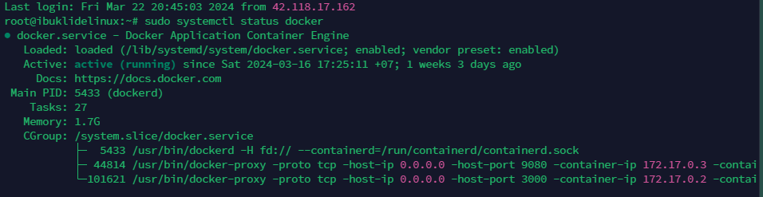

# Cài đặt
### 1. Cập nhật danh sách gói và cài đặt các gói cần thiết
Mở terminal và chạy lệnh sau để cập nhật danh sách gói và cài đặt các gói cần thiết cho việc cài đặt Docker:
```bash
sudo apt-get update
sudo apt-get install apt-transport-https ca-certificates curl software-properties-common
```
### 2. Thêm khóa GPG chính thức của Docker
Thêm khóa GPG chính thức của Docker vào hệ thống của bạn:
```bash
curl -fsSL https://download.docker.com/linux/ubuntu/gpg | sudo apt-key add -
```
### 3. Thêm kho lưu trữ Docker vào APT sources
```bash
sudo add-apt-repository "deb [arch=amd64] https://download.docker.com/linux/ubuntu $(lsb_release -cs) stable"
```
### 4. Cập nhật danh sách gói sau khi thêm Docker repo
```bash
sudo apt-get update
```
### 5. Cài đặt Docker CE (Community Edition)
```bash
sudo apt-get install docker-ce
```
### 6. Kiểm tra trạng thái Docker
```bash
sudo systemctl status docker
```
**Active như này là oke nè:**

 

### **Một số lệnh Docker hay dùng cho nginx
 | Command | Mô tả |
|---------------|---------------|
| `docker --version`    | Kiểm tra version docker    |
| `docker ps` hoặc `docker ps -a`    | Kiểm tra trạng thái của container    |
| `docker rm <id,name>`    | xóa 1 hoặc nhiều docker container    |
| `docker logs <id, name>`    | Hiện log của container   |
| `docker images`    | Hiện các images đã pull về  |
| `docker pull <image_name>:<tag>`    | Tải xuống một Image từ Docker Hub  |
| `docker rmi <image_name>:<tag>`    | Xóa 1 Image  |