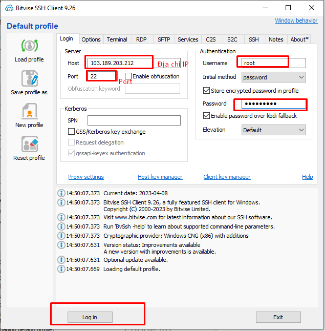

# Chào mừng!

**Ubuntu Server** khá là nhẹ nên tài liệu này hướng dẫn làm trên **Ubuntu Server** nhé

## Chuẩn bị:
 - 1 VPS cài Ubuntu Server (có thể thuê trên [clouding.vn](https://clouding.vn))
 - Máy remote cài sẵn [termius](https://termius.com/) hoặc [Bitvise SSH Client](https://www.bitvise.com/ssh-client-download) để remote tới máy chủ Ubuntu
 - Remote tới máy chủ ubuntu với **Bitvise SSH Client** theo hình dưới:

 
## What's next?

- Read the [official documentation](https://docusaurus.io/)
- Modify your site configuration with [`docusaurus.config.js`](https://docusaurus.io/docs/api/docusaurus-config)
- Add navbar and footer items with [`themeConfig`](https://docusaurus.io/docs/api/themes/configuration)
- Add a custom [Design and Layout](https://docusaurus.io/docs/styling-layout)
- Add a [search bar](https://docusaurus.io/docs/search)
- Find inspirations in the [Docusaurus showcase](https://docusaurus.io/showcase)
- Get involved in the [Docusaurus Community](https://docusaurus.io/community/support)
